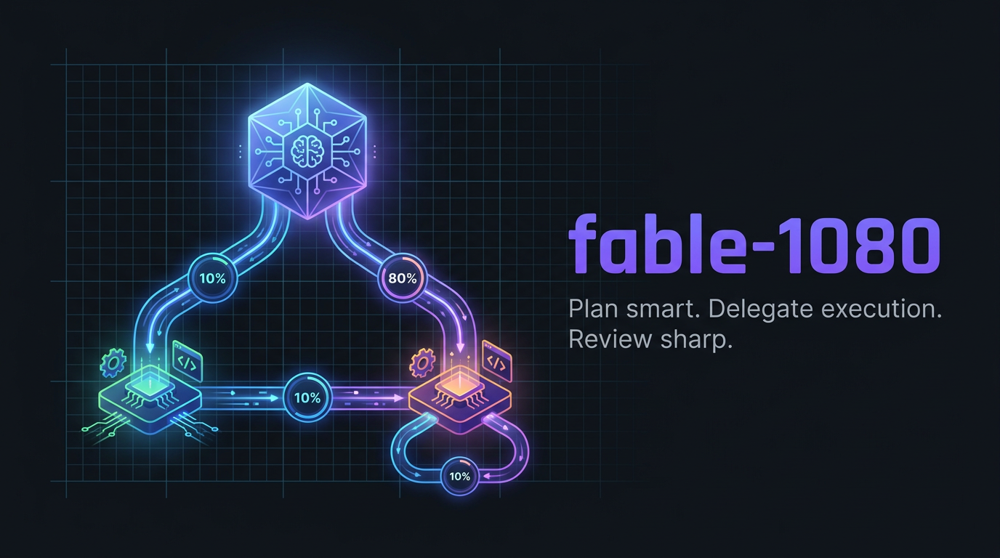

<p align="center">
  
</p>

<p align="center">
  <a href="https://skills.sh/Shavy72/claude-skill-fable-1080"></a>
  <a href="https://github.com/Shavy72/claude-skill-fable-1080/blob/main/LICENSE"></a>
  <a href="https://github.com/Shavy72/claude-skill-fable-1080/stargazers"></a>
</p>

# claude-skill-fable-1080

**10-80-10 delegation protocol for Claude Code** — the frontier model plans and reviews, cheaper executor subagents do the implementation.

A frontier model (e.g. Claude Fable 5) is worth its price in exactly two places: designing the change and judging the result. The middle part — writing files, wiring imports, running tests, fixing the typo the test just found — is where 80 % of the tokens burn, and it does not need frontier intelligence. This skill makes that split explicit and enforceable.

```
 10 %          80 %                    10 %
 PLAN    →     EXECUTE          →      REVIEW
 frontier      executor-opus           frontier
 model         executor-sonnet         model
 (handoff)     (implementation)        (diff + acceptance)
```

## What's new in 1.1.0

- Recalibrated for the Claude 5 family (Opus 5/Sonnet 5); Opus 5's low-effort strength lowers the delegation threshold.
- `effort:` is now fixed in each executor's frontmatter (`opus: medium`, `sonnet: low`) instead of leaking in from the session — no more accidental frontier-price execution.
- `tools:` allowlist on both executors for hard subagent damping.
- Slimmer executor report format (`VERIFICATION:` + `DEVIATIONS:`), no more over-verification instructions in handoffs.
- Documented cache rules (effort switch = cache miss, 5-min subagent TTL, forks inherit session cache) and an Opus pre-review step for large diffs.
- Measured: −63 % execution tokens in an A/B test (33k vs. 90k); a follow-up via resume costs ≈ 3.5k tokens.

## Quickstart

```bash
npx skills add Shavy72/claude-skill-fable-1080
```

The `skills` CLI installs `SKILL.md` only. The two executor agents still need to be copied into `~/.claude/agents/` yourself:

```bash
# bash / macOS / Linux / WSL
cp agents/*.md ~/.claude/agents/
```

```powershell
# PowerShell / Windows
Copy-Item agents\*.md "$env:USERPROFILE\.claude\agents\"
```

Restart Claude Code afterwards so it picks up the new agents.

## How it works (10-80-10)

**Phase 1 — PLAN (frontier model, ~10 %).** Classify the task: complex/multi-file/debugging → `executor-opus`; routine/boilerplate/mechanical → `executor-sonnet`; under ~10 lines in a single file → just do it yourself, the delegation overhead is not worth it. Read the minimum context needed (Grep/Glob first, `Read` with offset/limit), run the Lazy Ladder over the plan, then write the handoff.

**Phase 2 — EXECUTE (subagent, ~80 %).** Delegate via the Agent tool with an explicit `subagent_type`. Split large work into bounded increments (1 increment = 1 handoff = 1 checkable result). Independent increments can run in parallel from a single message block. Do not read the same files while an executor is working on them.

> **The one rule you must not break:** never spawn a subagent without an explicit model. An agent without a model override inherits the frontier session model — and then you are paying frontier prices for exactly the 80 % you were trying to move off it.

**Phase 3 — REVIEW (frontier model, ~10 %).** Review the `git diff`, not the files. Judge against the ACCEPTANCE criteria of the handoff, not against taste. Run a complexity pass (one line per finding, tags `delete:` / `stdlib:` / `native:` / `yagni:` / `shrink:`). Check the executor's verification evidence and re-run the decisive check yourself when in doubt. Small findings go back to the living executor via `SendMessage`; step in yourself only for architectural errors.

## Installation

### Option 1 — skills CLI

```bash
npx skills add Shavy72/claude-skill-fable-1080
cp agents/*.md ~/.claude/agents/   # skills CLI does not install agents
```

### Option 2 — Claude Code plugin

```
/plugin marketplace add Shavy72/claude-skill-fable-1080
/plugin install fable-1080@claude-skill-fable-1080
```

The plugin ships `SKILL.md` and both executor agents together — no manual copy step needed.

### Option 3 — git clone

```bash
git clone https://github.com/Shavy72/claude-skill-fable-1080.git
cd claude-skill-fable-1080

# 1) the orchestrator skill
mkdir -p ~/.claude/skills/fable-1080
cp SKILL.md ~/.claude/skills/fable-1080/SKILL.md

# 2) the two executor agents
mkdir -p ~/.claude/agents
cp agents/executor-opus.md agents/executor-sonnet.md ~/.claude/agents/
```

Restart Claude Code. Use `/fable-1080`, or let it trigger on its own on implementation requests.

Install per project instead of globally by using `.claude/skills/` and `.claude/agents/` inside the repo.

## Why this saves tokens

- The expensive model never reads the whole repo — it reads only what the plan needs, and reviews only the diff.
- Implementation context (file contents, test output, failed attempts, retry loops) lives inside the subagent and never enters the orchestrator's context window.
- Follow-up fixes go back to the *same* living subagent via `SendMessage`, so its cache is reused instead of reprocessing everything from scratch.
- The handoff format forces the plan to be complete before any token is spent on execution. Underspecified tasks are the second biggest token waste after blind exploration.

## The handoff — the central artifact

Nothing gets delegated without this block. It is the definition of ready, and it doubles as the review checklist in Phase 3:

```
GOAL: <what works at the end, 1-2 sentences>
WHY: <intent/context — prevents wrong directions>
FILES: <affected paths + what happens there>
CONTRACT: <signatures, data models, names that are fixed>
ACCEPTANCE: <checkable criteria, including which test/command must be green>
OUT-OF-SCOPE: <what is explicitly NOT touched>
```

The executor answers in a fixed, equally terse format — `CHANGED:` / `VERIFICATION:` / `SKIPPED:` / `OPEN:` — so the review is a scan, not a reading session.

### The Lazy Ladder

Both executors run the same ladder before writing anything — the first rung that holds wins:

1. Does this need to exist at all? (YAGNI)
2. Does it already exist in the codebase?
3. Can the stdlib do it?
4. Is there a native platform feature (CSS instead of JS, DB constraint instead of app code)?
5. Is there an already-installed dependency?
6. Does it fit in one line?
7. Only then: the minimum that works cleanly.

Counterweight: a **safety floor** that is never simplified away — input validation at trust boundaries, error handling against data loss, security, accessibility basics, anything explicitly requested. Deliberate simplifications with a known ceiling are marked in code with a `ponytail: <ceiling>, <upgrade path>` comment, so the next reader knows it was a choice and not an oversight.

## Adapting it to other models

The pattern is model-agnostic. It only needs a capability gradient: one strong orchestrator, one or more cheaper executors.

- Swap the `model:` field in `agents/*.md` for whatever your setup offers (`opus`, `sonnet`, `haiku`, or a named model).
- Keep two tiers if you can — one for complex work, one for mechanical work. The classification step in Phase 1 is what makes the split pay off.
- Rename the files if the naming bothers you; just keep `name:` in the frontmatter and the `subagent_type` you pass in sync.
- The locale convention in the executor contracts (real German umlauts in user-facing strings) is an example, not a requirement — replace it with whatever your product's languages need, or drop the line.

## License

MIT — see [LICENSE](LICENSE).
